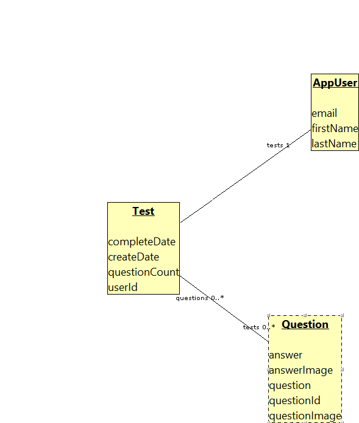

# FlashCards

A simple flash card application that runs in as a single page web app. THe technolgy stack is Java 11, with Jersey, and Bootique.io as the container. I'm using a postgres database to hold the records. The intent is to write a single page web app using angular js and then connect it to a bootique.io backend that's running in jetty.  

## Phase 1
In phase one, I'm just going to build the basic restful service, and include a spreadsheet upload capability to populate the database with a bank of questions. Questions and Answers are going to be just textual information. There's room in the db to reference images as well, and that will be part of a phase two implementation. 

##Phase 2

Build the angular js app that's delivered via jetty and connects with the back end, there's no web security on this application so anyone can create a user and use that users to build up question banks and tests. 

